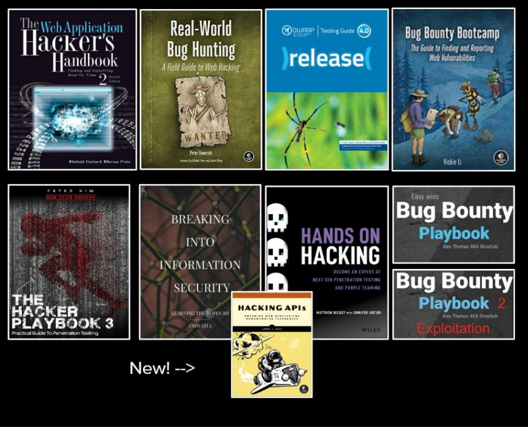

# Vulnerability Scanner

Build a script that scans a target website for common issues like- 

## Methodologies

- [Open-Source Security Testing Methodology Manual- OSSTMM]()
- [Open Web Application Security Project- OWASP](https://github.com/aditya026/random-dev-shit/blob/main/03-vuln-scanner/notes/OWASP.m)
- [Penetration Testing Execution Standard- PTES]()
- [Information System Security Assessment Framework- ISSAF]() 
- [National Institute of Standards and Technology- NIST]()

## BOOKS 

-
